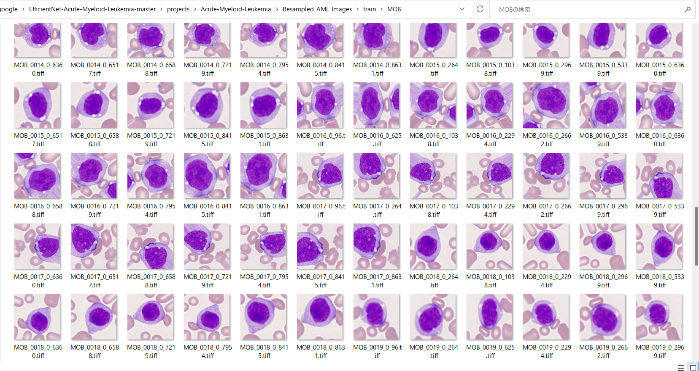

<h2>EfficientNet-Acute-Myeloid-Leukemia (Updated: 2023/04/02)</h2>
<a href="#1">1 EfficientNetV2 Acute-Myeloid-Leukemia Classification </a> 
<a href="#1.1">1.1 Clone repository</a> 
<a href="#1.2">1.2 Prepare Peripheral Blood Cell dataset</a> 
<a href="#1.3">1.3 Install Python packages</a> 
<a href="#2">2 Python classes for Peripheral Blood Cell Classification</a> 
<a href="#3">3 Pretrained model</a> 
<a href="#4">4 Train</a> 
<a href="#4.1">4.1 Train script</a> 
<a href="#4.2">4.2 Training result</a> 
<a href="#5">5 Inference</a> 
<a href="#5.1">5.1 Inference script</a> 
<a href="#5.2">5.2 Sample test images</a> 
<a href="#5.3">5.3 Inference result</a> 
<a href="#6">6 Evaluation</a> 
<a href="#6.1">6.1 Evaluation script</a> 
<a href="#6.2">6.2 Evaluation result</a> 

<h2>
<a id="1">1 EfficientNetV2 Acute-Myeloid-Leukemia Classification</a>
</h2>

 This is an experimental Acute-Myeloid-Leukemia Image Classification project based on <b>efficientnetv2</b> in <a href="https://github.com/google/automl">Brain AutoML</a>.
 
The AML image dataset used here has been taken from the following web site; 
<pre>
CANCER IMAGING ARCHIVE

https://faspex.cancerimagingarchive.net/aspera/faspex/external_deliveries/77?passcode=a6be8bf0a97ddb34fc0913f37b8180d8f7d616a7

Package - AML-Cytomorphology
From:
Natasha Honomichl
To:
help@cancerimagingarchive.net 
CC (on download):
Natasha Honomichl
Date Sent:
17 Feb 2021 01:11 PM
</pre>

 
 We use python 3.8 and tensorflow 2.8.0 environment on Windows 11. 
<h3>
<a id="1.1">1.1 Clone repository</a>
</h3>
 Please run the following command in your working directory: 
<pre>
git clone https://github.com/sarah-antillia/EfficientNet-Acute-Myeloid-Leukemia.git
</pre>
You will have the following directory tree: 
<pre>
.
├─asset
└─projects
    └─Acute-Myeloid-Leukemia
        ├─eval
        ├─evaluation
        ├─inference        
        └─test
</pre>
<h3>
<a id="1.2">1.2 AML dataset</a>
</h3>

 
1 Resampling  
We have created <b>Resampled_AML-Cytomorphology_400_360x360</b> dataset from
the original image dataset <b>AML-Cytomorphology</b> by using 
<a href="">ImageDatasetResampler</a>
The number of images of the original dataset AML-Cytomorphology is the following:
<pre>
[('BAS', 79), 
 ('EBO', 78), 
 ('EOS', 424), 
 ('KSC', 15), 
 ('LYA', 11), 
 ('LYT', 3937), 
 ('MMZ', 15), 
 ('MOB', 26), 
 ('MON', 1789), 
 ('MYB', 42), 
 ('MYO', 3268), 
 ('NGB', 109), 
 ('NGS', 8484), 
 ('PMB', 18), 
 ('PMO', 70)]
</pre>
, which is a typical imbalanced image dataset, and you can see that the numbers of images of 'KSC', 'LYA', 'MMZ' and 'PMB' are very small compared with those of 
'LYT', 'MYO' and 'NGS'. 
Hence, we have created <b>AML-Cytomorphology_400_360x360</b> dataset from the original dataset to resolve the imbalanced problem
by using <a href="https://github.com/martian-antillia/ImageDatasetResampler">ImageDatasetResampler</a>.

<pre>
[('BAS', 395), 
 ('EBO', 390), 
 ('EOS', 400), 
 ('KSC', 390), 
 ('LYA', 396), 
 ('LYT', 400), 
 ('MMZ', 390), 
 ('MOB', 390), 
 ('MON', 400), 
 ('MYB', 378), 
 ('MYO', 400), 
 ('NGB', 327), 
 ('NGS', 400), 
 ('PMB', 396), 
 ('PMO', 350)]
</pre>

2 Splitting train and test dataset 
Furthermore, we have created <b>Resampled_AML_Images</b> dataset from the <b>AML-Cytomorphology_400_360x360</b> 
by using <a href="./projects/Acute-Myeloid-Leukemia/split_master.py">split_master.py </a> script, 
by which we have splitted the master dataset to train and test dataset. 
<pre>
>python split_master.py
</pre> 

The destribution of images in those dataset is the following; 
 

<pre>
.
├─asset
└─projects
    └─Acute-Myeloid-Leukemia
        ├─eval
        ├─evaluation
        ├─inference
        ├─models
        │  └─chief
        ├─Resampled_AML_Images
        │  ├─test
        │  │  ├─BAS
        │  │  ├─EBO
        │  │  ├─EOS
        │  │  ├─KSC
        │  │  ├─LYA
        │  │  ├─LYT
        │  │  ├─MMZ
        │  │  ├─MOB
        │  │  ├─MON
        │  │  ├─MYB
        │  │  ├─MYO
        │  │  ├─NGB
        │  │  ├─NGS
        │  │  ├─PMB
        │  │  └─PMO
        │  └─train
        │      ├─BAS
        │      ├─EBO
        │      ├─EOS
        │      ├─KSC
        │      ├─LYA
        │      ├─LYT
        │      ├─MMZ
        │      ├─MOB
        │      ├─MON
        │      ├─MYB
        │      ├─MYO
        │      ├─NGB
        │      ├─NGS
        │      ├─PMB
        │      └─PMO
        └─test
</pre>

 

1 Sample images of Resampled_AML_Images/train/BAS: 

  

2 Sample images of Resampled_AML_Images/train/EBO: 

  

3 Sample images of Resampled_AML_Images/train/EOS: 

  

4 Sample images of Resampled_AML_Images/train/KSC: 

  

5 Sample images of Resampled_AML_Images/train/LYA: 

  

6 Sample images of Resampled_AML_Images/train/LYT: 

 

7 Sample images of Resampled_AML_Images/train/MMZ: 

  

8 Sample images of Resampled_AML_Images/train/MOB: 

  

9 Sample images of Resampled_AML_Images/train/MON: 

  

10 Sample images of Resampled_AML_Images/train/MYB: 

  

11 Sample images of Resampled_AML_Images/train/MYO: 

  

12 Sample images of Resampled_AML_Images/train/NGB: 

  

13 Sample images of Resampled_AML_Images/train/NGS: 

  

14 Sample images of Resampled_AML_Images/train/PMB: 

  

15 Sample images of Resampled_AML_Images/train/PMO: 

  

  

 

<h3>
<a id="#1.3">1.3 Install Python packages</a>
</h3>
Please run the following commnad to install Python packages for this project. 
<pre>
pip install -r requirements.txt
</pre>
 

<h2>
<a id="2">2 Python classes for LymphomaClassification</a>
</h2>
We have defined the following python classes to implement our LymphomaClassification. 
<li>
<a href="./ClassificationReportWriter.py">ClassificationReportWriter</a>
</li>
<li>
<a href="./ConfusionMatrix.py">ConfusionMatrix</a>
</li>
<li>
<a href="./CustomDataset.py">CustomDataset</a>
</li>
<li>
<a href="./EpochChangeCallback.py">EpochChangeCallback</a>
</li>
<li>
<a href="./EfficientNetV2Evaluator.py">EfficientNetV2Evaluator</a>
</li>
<li>
<a href="./EfficientNetV2Inferencer.py">EfficientNetV2Inferencer</a>
</li>
<li>
<a href="./EfficientNetV2ModelTrainer.py">EfficientNetV2ModelTrainer</a>
</li>
<li>
<a href="./FineTuningModel.py">FineTuningModel</a>
</li>

<li>
<a href="./TestDataset.py">TestDataset</a>
</li>

<h2>
<a id="3">3 Pretrained model</a>
</h2>
 We have used pretrained <b>efficientnetv2-m</b> to train LymphomaModel.
Please download the pretrained checkpoint file 
from <a href="https://storage.googleapis.com/cloud-tpu-checkpoints/efficientnet/v2/efficientnetv2-m.tgz">efficientnetv2-m.tgz</a>, expand it, and place the model under our top repository.

<pre>
.
├─asset
├─efficientnetv2-m
└─projects
    └─Acute-Myeloid-Leukemia
 ...
</pre>

<h2>
<a id="4">4 Train</a>

</h2>
<h3>
<a id="4.1">4.1 Train script</a>
</h3>
Please run the following bat file to train our AML efficientnetv2 model by using
<b>Resampled_AML_images/train</b>.
<pre>
./1_train.bat
</pre>
<pre>
rem 1_train.bat
python ../../EfficientNetV2ModelTrainer.py ^
  --model_dir=./models ^
  --eval_dir=./eval ^
  --model_name=efficientnetv2-m ^
  --data_generator_config=./data_generator.config ^
  --ckpt_dir=../../efficientnetv2-m/model ^
  --optimizer=rmsprop ^
  --image_size=360 ^
  --eval_image_size=360 ^
  --data_dir=./Resampled_AML_images/train ^
  --data_augmentation=True ^
  --fine_tuning=True ^
  --monitor=val_loss ^
  --learning_rate=0.001 ^
  --trainable_layers_ratio=0.4 ^
  --dropout_rate=0.2 ^
  --num_epochs=100 ^
  --batch_size=4 ^
  --patience=10 ^
  --debug=True  

</pre>
, where data_generator.config is the following: 
<pre>
; data_generation.config
[training]
validation_split   = 0.2
featurewise_center = False
samplewise_center  = False
featurewise_std_normalization=False
samplewise_std_normalization =False
zca_whitening                =False
rotation_range     = 10
horizontal_flip    = True
vertical_flip      = True
width_shift_range  = 0.05
height_shift_range = 0.05
shear_range        = 0.00
zoom_range         = [0.5, 1.5]

;channel_shift_range= 10
;brightness_range   = [80,100]
data_format        = "channels_last"

</pre>

<h3>
<a id="4.2">4.2 Training result</a>
</h3>

This will generate a <b>best_model.h5</b> in the models folder specified by --model_dir parameter. 
Furthermore, it will generate a <a href="./projects/Acute-Myeloid-Leukemia/eval/train_accuracies.csv">train_accuracies</a>
and <a href="./projects/Acute-Myeloid-Leukemia/eval/train_losses.csv">train_losses</a> files
 
Training console output: 
 
 
Train_accuracies: 
 

 
Train_losses: 
 

 
<h2>
<a id="5">5 Inference</a>
</h2>
<h3>
<a id="5.1">5.1 Inference script</a>
</h3>
Please run the following bat file to infer the skin cancer lesions in test images by the model generated by the above train command. 
<pre>
./2_inference.bat
</pre>
<pre>
rem 2_inference.bat
python ../../EfficientNetV2Inferencer.py ^
  --model_name=efficientnetv2-m  ^
  --model_dir=./models ^
  --fine_tuning=True ^
  --trainable_layers_ratio=0.4 ^
  --dropout_rate=0.2 ^
  --image_path=./test/*.tiff ^
  --eval_image_size=360 ^
  --label_map=./label_map.txt ^
  --mixed_precision=True ^
  --infer_dir=./inference ^
  --debug=False 
</pre>
 
label_map.txt:
<pre>
BAS
EBO
EOS
KSC
LYA
LYT
MMZ
MOB
MON
MYB
MYO
NGB
NGS
PMB
PMO
</pre>
 
<h3>
<a id="5.2">5.2 Sample test images</a>
</h3>

Sample test images generated by <a href="./projects/Acute-Myeloid-Leukemia/create_test_dataset.py">create_test_dataset.py</a> 
from <a href="./projects/Acute-Myeloid-Leukemia/Resampled_AML_Images/test">Lymphoma/test</a>.
 
 

 
<h3>
<a id="5.3">5.3 Inference result</a>
</h3>
This inference command will generate <a href="./projects/Acute-Myeloid-Leukemia/inference/inference.csv">inference result file</a>.
 At this time, you can see the inference accuracy for the test dataset by our trained model is very low.
More experiments will be needed to improve accuracy. 

 
Inference console output: 
 
 

Inference result (<a href="./projects/Acute-Myeloid-Leukemia/inference/inference.csv">inference.csv</a>): 
 
 
<h2>
<a id="6">6 Evaluation</a>
</h2>
<h3>
<a id="6.1">6.1 Evaluation script</a>
</h3>
Please run the following bat file to evaluate <a href="./projects/Acute-Myeloid-Leukemia/Resampled_AML_Images/test">
Malaris_Cell_Images/test</a> by the trained model. 
<pre>
./3_evaluate.bat
</pre>
<pre>
rem 3_evaluate.bat
python ../../EfficientNetV2Evaluator.py ^
  --model_name=efficientnetv2-m  ^
  --model_dir=./models ^
  --data_dir=./Resampled_AML_Images/test ^
  --evaluation_dir=./evaluation ^
  --fine_tuning=True ^
  --trainable_layers_ratio=0.4 ^
  --dropout_rate=0.2 ^
  --eval_image_size=360 ^
  --mixed_precision=True ^
  --debug=False 
 
</pre>
 

<h3>
<a id="6.2">6.2 Evaluation result</a>
</h3>

This evaluation command will generate <a href="./projects/Acute-Myeloid-Leukemia/evaluation/classification_report.csv">a classification report</a>
 and <a href="./projects/Acute-Myeloid-Leukemia/evaluation/confusion_matrix.png">a confusion_matrix</a>.
 
 
Evaluation console output: 
 
 

 
Classification report: 
 
 
Confusion matrix: 
 

 
<h3>
References
</h3>
<b>1. AML-Cytomorphology</b> 
<pre>
The AML image dataset used here has been taken from the following web site;
CANCER IMAGING ARCHIVE
https://faspex.cancerimagingarchive.net/aspera/faspex/external_deliveries/77?passcode=a6be8bf0a97ddb34fc0913f37b8180d8f7d616a7
</pre>

<b>2. Acute Myeloid Leukemia classification using a federated Convolutional Neural Network</b> 
scaleoutsystems 
<pre>
https://github.com/scaleoutsystems/AML-tutorial
</pre>

<b>3. Deep learning detects acute myeloid leukemia and predicts NPM1 mutation status from bone marrow smears</b> 
Jan-Niklas Eckardt, Jan Moritz Middeke, Sebastian Riechert, Tim Schmittmann, Anas Shekh Sulaiman,  
Michael Kramer, Katja Sockel, Frank Kroschinsky, Ulrich Schuler, Johannes Schetelig, Christoph Röllig,  
Christian Thiede, Karsten Wendt & Martin Bornhäuser  

<pre>
https://www.nature.com/articles/s41375-021-01408-w
</pre>

<b>4. AMLnet, A deep-learning pipeline for the differential diagnosis of acute myeloid leukemia from bone marrow smears</b> 
Zebin Yu, Jianhu Li, Xiang Wen, Yingli Han, Penglei Jiang, Meng Zhu, Minmin Wang, Xiangli Gao,  
Dan Shen, Ting Zhang, Shuqi Zhao, Yijing Zhu, Jixiang Tong, Shuchong Yuan, HongHu Zhu, He Huang & Pengxu Qian  
<pre>
https://jhoonline.biomedcentral.com/articles/10.1186/s13045-023-01419-3
</pre>
